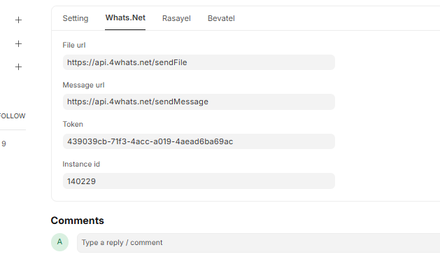
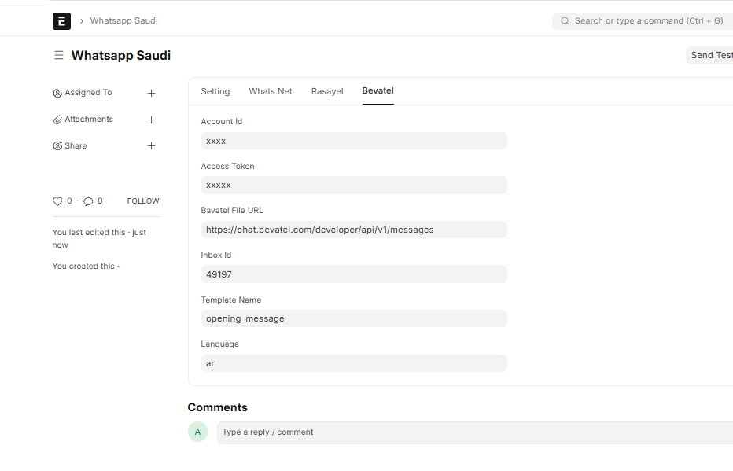
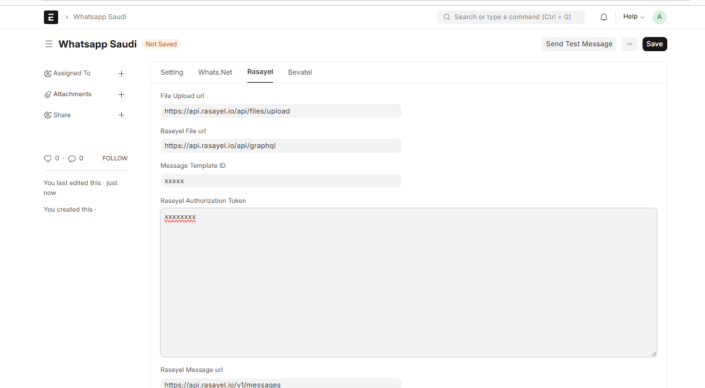

# 📌 Whatsapp Saudi

Integration with **Saudi.support WhatsApp** for **ERPNext**.

###### License

mit# whatsapp_saudi<br>
This app integrates ERPNext with  4Whats.net ,  Global   Whatsapp provider. The provider site can be accessed here (https://4whats.net/)


## 🔧 Installation Guide
Follow these steps to install **Whatsapp Saudi** and integrate it with **ERPNext**:

### 1️⃣ Prerequisites
- You must have **ERPNext** installed and running.
- Install **Python** (>=3.8) and **Frappe Framework**.

### 2️⃣ Clone the Repository
Open your terminal and run:
```bash
git clone https://github.com/ERPGulf/whatsapp_saudi.git
cd whatsapp_saudi
```

### 3️⃣ Install Dependencies
Run the following command inside the project directory:
```bash
pip install -r requirements.txt
```

### 4️⃣ Setup ERPNext App
Inside your ERPNext environment, install the app:
```bash
bench get-app whatsapp_saudi
bench --site your-site-name install-app whatsapp_saudi
```

### 5️⃣ Migrate and Restart
```bash
bench --site your-site-name migrate
bench restart
```
## ⚙️ Configuration

### Multi-Provider WhatsApp Support
- Whatsapp Saudi now supports multiple WhatsApp providers, making it flexible and scalable for different  business requirements.
#### Currently Supported Providers:
1- **4Whats.net**

2- **Bevatel**

3- **Rasayel**

More providers can be added in future versions.
- Add your API Key and Instance ID in ERPNext settings.


## 🚀 Features (Version 2.0)
### ✅ New Additions:
1-**Send PDFs & Documents**
- You can now send PDF documents directly via WhatsApp.

2-**Error logs**
- Errors are now logged under error logs.

3-**incoming Messages**
- We have set up a webhook in 4Whats.net to handle incoming messages.
- Incoming messages are automatically stored in the WhatsApp Response Doctype in ERPNext for tracking and further processing.

### 🔌 Provider Configuration
###   1️⃣ 4Whats.net (Global Provider)
- Instance ID
- API Token
- Webhook URL

Supports:

✅ Text Messages

✅ File Sending

✅ Incoming Webhook Handling





- After the entry of data click on the button(send test message) then message will send to whatsapp number.
<br>


## Webhook Setup for Incoming Messages
- In **4Whats.net**, set up a webhook to receive incoming messages.
- Use the following Base URL for the webhook:
```bash
https://your-erpnext-instance.com/api/method/whatsapp_saudi.receive_whatsapp_message
```
(Replace your-erpnext-instance.com with your actual ERPNext URL.)

- This webhook ensures that all incoming messages are stored in the WhatsApp Response Doctype in ERPNext.
<br>


### 2️⃣  Bevatel Integration

Bevatel credentials are taken from your Bevatel profile.

 ### 🔑 Required Credentials:

- API Account ID

- API Access Token

- Inbox ID

- Base API URL

These credentials must be configured inside:

ERPNext → WhatsApp Saudi → Provider Settings




#### 📩 Supported Features:

✅ Template-based messages

✅ Text messages


### 3️⃣ Rasayel Integration

Rasayel credentials are taken from your Rasayel dashboard.

#### 🔑 Required Credentials:

- API Token

- Base URL

- Template Name

- Language Code

#### Configured inside:

ERPNext → WhatsApp Saudi → Provider Settings




## 🧩 Template Handling System
Whatsapp Saudi supports dynamic template mapping.

#### 🔹 Variable-Based Templates

Templates can include variables like:

```bash
Hello {{customer_name}},
Your invoice {{invoice_no}} is ready.
```
These variables are automatically fetched from ERPNext documents (Sales Invoice, Quotation, etc.) and mapped dynamically before sending.

🔹 Separate Template Structure

- Each provider may have different template formats.

- The app automatically formats the payload according to the selected provider.

- Language selection is supported (e.g., en, ar).

### 📎 File & Document Sending

Supported (Provider Dependent):

- PDF files (Invoices, Quotations)

- Attachments from ERPNext

- Static documents

Currently:

- ✅ Rasayel → Fully supported

- ✅ 4Whats → Supported

- 🚧 Bevatel → Based on API capability


# 👤 Author
Aysha Sithara.
