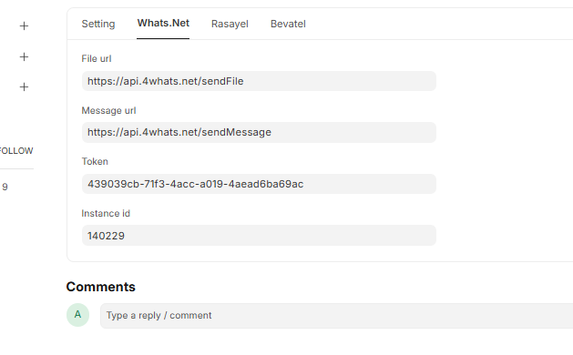
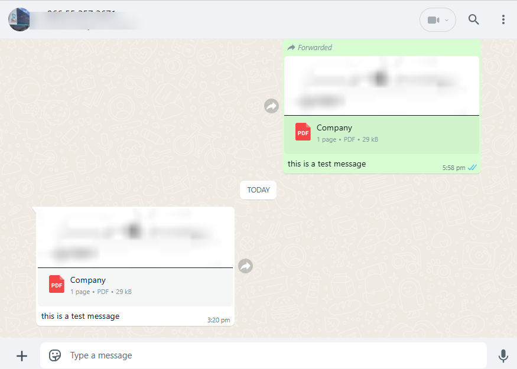
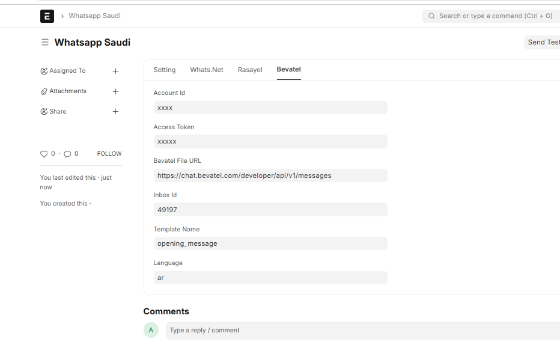
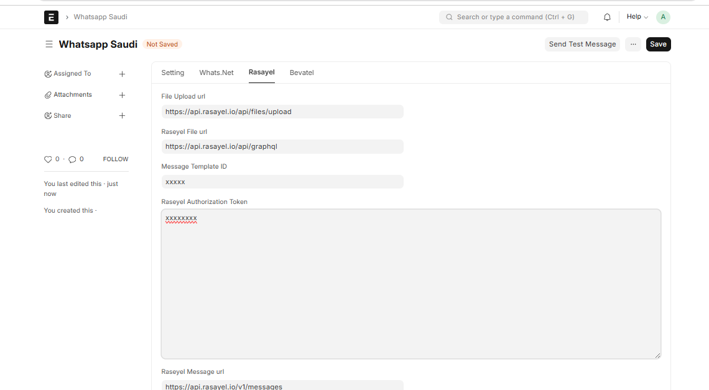
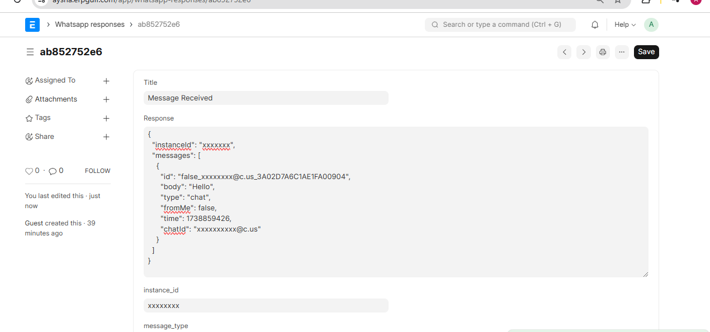

# WhatsApp Saudi

---
**Lead Technical Consultant:** Fadi Al-Qassas
**Focus:** Secure API Gateway Architecture & Automated WhatsApp Business Integration
---

> Multi-provider WhatsApp & Firebase push notification integration for ERPNext / Frappe Framework.
...
[](./license.txt)
[](https://frappeframework.com)
[](https://erpnext.com)
[](https://erpgulf.com)

---

## Table of Contents

- [Overview](#overview)
- [Features](#features)
- [Prerequisites](#prerequisites)
- [Installation](#installation)
- [Configuration](#configuration)
  - [4Whats.net](#1-4whatsnet-global-provider)
  - [Bevatel](#2-bevatel)
  - [Rasayel](#3-rasayel)
  - [Firebase Notifications](#4-firebase-notifications)
- [Webhook Setup](#webhook-setup-for-incoming-messages)
- [Template Handling](#template-handling-system)
- [File & Document Sending](#file--document-sending)
- [API Reference](#api-reference)
- [Author](#author)

---

## Overview

**WhatsApp Saudi** integrates ERPNext with multiple WhatsApp business API providers, enabling automated notifications, document delivery, and incoming message handling — all from within ERPNext. It also supports **Firebase Cloud Messaging (FCM)** for push notifications to Android and iOS apps.

The app overrides the standard Frappe `Notification` doctype to add a **WhatsApp Saudi** channel and a **Firebase Notification** channel alongside the built-in Email/SMS channels.

---

## Features

### v2.0 Highlights

| Feature | Description |
|---|---|
| Multi-provider support | Switch between 4Whats.net, Bevatel, and Rasayel from a single setting |
| Send PDFs & Documents | Attach Sales Invoice PDFs (standard or PDF/A-3) directly via WhatsApp |
| Firebase Push Notifications | Send to individual device tokens or broadcast to topics (Android + iOS) |
| Incoming message webhook | Incoming WhatsApp messages are stored in the **WhatsApp Response** doctype |
| Error logging | All API failures are captured in Frappe Error Log |
| Success logging | Successful sends are recorded in the **WhatsApp Saudi Success Log** doctype |
| Dynamic templates | Template variables are fetched from ERPNext documents at send time |
| Saudi phone normalisation | Local 05xxxxxxxx numbers are automatically converted to 9665xxxxxxxx |

---

## Prerequisites

- ERPNext **v15** (Frappe Framework v15)
- Python **>= 3.10**
- An active account with at least one supported provider (4Whats.net, Bevatel, or Rasayel)
- *(Optional)* A Firebase project with a service-account key for push notifications

---

## Installation

### 1. Get the app

```bash
bench get-app https://github.com/ERPGulf/whatsapp_saudi.git
```

### 2. Install on your site

```bash
bench --site your-site-name install-app whatsapp_saudi
```

### 3. Migrate and restart

```bash
bench --site your-site-name migrate
bench restart
```

---

## Configuration

All provider credentials are stored in a single **Whatsapp Saudi** singleton doctype:

```
ERPNext → WhatsApp Saudi → Whatsapp Saudi
```

---

### 1. 4Whats.net (Global Provider)



| Field | Description |
|---|---|
| Instance ID | Your 4Whats.net instance identifier |
| API Token | API token from your 4Whats.net dashboard |
| Message URL | REST endpoint for text messages |
| File URL | REST endpoint for file/PDF messages |
| Webhook URL | Receive incoming messages (see [Webhook Setup](#webhook-setup-for-incoming-messages)) |

**Supported:**
- Text messages
- PDF / file sending
- Incoming webhook handling

After filling in the credentials, click **Send Test Message** to verify connectivity.



---

### 2. Bevatel



| Field | Description |
|---|---|
| Account ID | API Account ID from your Bevatel profile |
| Access Token | API Access Token from your Bevatel profile |
| Inbox ID | The inbox to send messages through |
| Base API URL | Bevatel base API URL |
| Template Name | Default WhatsApp template name |
| Language | Default language code (e.g. `en`, `ar`) |

**Supported:**
- Template-based text messages
- Template-based PDF messages (PDF/A-3)

---

### 3. Rasayel



| Field | Description |
|---|---|
| Authorization Token | Bearer token from your Rasayel dashboard |
| Channel ID | Rasayel channel ID |
| Message Template ID | Default template ID for text messages |
| Rasayel Message API | GraphQL endpoint for text messages |
| Rasayel File API | GraphQL endpoint for file uploads and file messages |
| File Upload URL | REST endpoint for blob uploads |

**Supported:**
- Template-based text messages
- PDF and PDF/A-3 document sending
- Conversation auto-close after message delivery

---

### 4. Firebase Notifications

#### Step 1 — Configure Firebase credentials in Whatsapp Saudi Settings

Navigate to:

```
ERPNext → WhatsApp Saudi → Whatsapp Saudi
```

Enable the **Firebase Notification** toggle, then fill in the service-account fields using values from your Firebase project's JSON key file:

| Field | Description |
|---|---|
| Type | `service_account` |
| Project ID | Firebase project ID |
| Private Key ID | Private key ID from the JSON key file |
| Private Key | Private key (PEM) from the JSON key file |
| Client Email | Service account email |
| Client ID | Service account client ID |
| Auth URI | `https://accounts.google.com/o/oauth2/auth` |
| Token URI | `https://oauth2.googleapis.com/token` |
| Auth Provider Cert URL | `https://www.googleapis.com/oauth2/v1/certs` |
| Client Cert URL | Service account X.509 cert URL |

Save the document.

---

#### Step 2 — Create a Notification

Navigate to:

```
ERPNext → Settings → Notification → New
```

Set the **Channel** field to **Firebase Notification**.

---

#### Step 3 — Set the Document Type

In the **Document Type** field, select the doctype that should trigger this notification (e.g. `Sales Invoice`, `Employee`, `Leave Application`, etc.).

---

#### Step 4 — Add Conditions (Optional)

Use the **Condition** field to filter when the notification fires. This supports Jinja2 expressions evaluated against the triggering document:

```
doc.status == "Submitted"
```

If you do not need a condition, leave the field blank — the notification will fire on every save of the selected document type.

---

#### Step 5 — Build the Message JSON

The **Message** field must contain a valid JSON payload.

**Sending to a single user (token-based):**

Use `"token"` and reference the FCM token field from your chosen document type. For example, if the **Employee** doctype stores the token in a field called `custom_fcm_token`:

```json
{
  "message": {
    "token": "{{ doc.custom_fcm_token }}",
    "notification": {
      "title": "Leave Request Update",
      "body": "{{ doc.employee_name }}, your leave request {{ doc.name }} has been {{ doc.status }}."
    }
  }
}
```

**Sending to multiple users (topic-based):**

Use `"topic"` and reference the topic field from your document type. Any employee who has subscribed to that topic will receive the notification:

```json
{
  "message": {
    "topic": "{{ doc.custom_topic }}",
    "notification": {
      "title": "Announcement",
      "body": "{{ doc.subject }}"
    }
  }
}
```

> The `"body"` field in `"notification"` can also reference a document field — for example `"{{ doc.description }}"` — to pull dynamic content from the triggering document.

---

#### Step 6 — Enable and Save

Tick the **Enabled** checkbox at the top of the Notification form and click **Save**.

---

#### Step 7 — Add Token / Topic to the Document Type

Open the doctype you selected in Step 3 and ensure the following custom fields exist:

| Purpose | Field type | Example field name |
|---|---|---|
| FCM device token | Data | `custom_fcm_token` |
| Topic (optional) | Data / Link | `custom_topic` |

Use the same field names you referenced in the JSON in Step 5.
if all the data added then save the doc after that the notification will recieve to the employee app.

---

#### How Tokens and Topics Work

**Device Token (single-user notifications)**

- The FCM device token for each user is stored in the **Employee** doctype, under the **User** section, in the **Token** field (`custom_fcm_token` or similar).
- Whenever a user logs in to the mobile app, their device token is automatically refreshed and saved in their Employee record.
- Use `"token"` in your JSON payload when the notification should go to one specific user only.

**Topics (multi-user / broadcast notifications)**
- Topics are managed through a **Topic** child table on the **Employee** doctype.
- A single employee can be subscribed to multiple topics simultaneously.
- When an employee subscribes to a topic, they receive every notification that is sent to that topic.
- Use `"topic"` in your JSON payload to broadcast a notification to all employees who have subscribed to that topic.

> Firebase messages are dispatched via a background queue (`long`) and support both Android (high-priority) and iOS (APNS) configurations automatically.

---

## Webhook Setup for Incoming Messages

In your **4Whats.net** dashboard, configure the webhook URL to:

```
https://your-erpnext-instance.com/api/method/whatsapp_saudi.receive_whatsapp_message
```

Replace `your-erpnext-instance.com` with your actual ERPNext domain.

All incoming messages will be automatically saved to the **WhatsApp Response** doctype in ERPNext.



---

## Template Handling System

WhatsApp Saudi supports dynamic variable substitution in notification templates.

### Variable-Based Templates

Define variables in the Notification **Message** field using `key="value"` pairs. Values support Jinja2 expressions:

```
message_template_id="123456"
var1="{{ doc.customer_name }}"
var2="{{ doc.name }}"
var3="{{ doc.grand_total }}"
language="en"
```

- Variables named `var1`, `var2`, … are automatically mapped to template body parameters in order.
- `message_template_id` selects the WhatsApp-approved template.
- `language` overrides the default language from the provider settings.

### Per-Provider Payload Format

The app automatically formats the payload for the active provider — no manual switching required.

---

## File & Document Sending

### From the Notification Doctype

Enable **Attach Print** and select a **Print Format** on any Notification configured with the **WhatsApp Saudi** channel. The app will generate the PDF and attach it to the outgoing message.

| Provider | Standard PDF | PDF/A-3 (ZATCA) |
|---|---|---|
| 4Whats.net | Supported | Supported |
| Rasayel | Supported | Supported |
| Bevatel | Supported | Supported |

### From the Sales Invoice Form

A **Send via WhatsApp** button is available directly on the Sales Invoice form. It reads the customer's `custom_whatsapp_number_` field and dispatches the active provider's PDF or PDF/A-3 flow.

---

---

## API Reference

All endpoints below are Frappe whitelisted methods callable via:
```
POST /api/method/<method_path>
```

| Method | Description |
|---|---|
| `whatsapp_saudi.overrides.whtatsapp_notification.send_whatsapp_text` | Send a plain-text WhatsApp message via 4Whats.net |
| `whatsapp_saudi.overrides.whtatsapp_notification.send_whatsapp_with_pdf1` | Send a PDF (standard) via 4Whats.net from a Sales Invoice |
| `whatsapp_saudi.overrides.whtatsapp_notification.get_whatsapp_pdf` | Provider-aware: send standard PDF (auto-routes to active provider) |
| `whatsapp_saudi.overrides.whtatsapp_notification.get_whatsapp_pdf_a3` | Provider-aware: send PDF/A-3 (auto-routes to active provider) |
| `whatsapp_saudi.overrides.whtatsapp_notification.rasayel_whatsapp_message1` | Send a Rasayel template text message directly by phone number |
| `whatsapp_saudi.overrides.whtatsapp_notification.rasayel_whatsapp_file_message_pdf` | Upload and send a standard PDF via Rasayel |
| `whatsapp_saudi.overrides.whtatsapp_notification.rasayel_whatsapp_file_message_pdfa3` | Upload and send a PDF/A-3 via Rasayel |
| `whatsapp_saudi.overrides.whtatsapp_notification.send_bevatel_file_template_message_pdf` | Send a standard PDF via Bevatel template |
| `whatsapp_saudi.overrides.whtatsapp_notification.send_bevatel_file_template_message_pdf_a3` | Send a PDF/A-3 via Bevatel template |
| `whatsapp_saudi.overrides.whtatsapp_notification.send_firebase_notification` | Send a Firebase push notification by token or topic |
| `whatsapp_saudi.overrides.whtatsapp_notification.test_firebase_push` | Test Firebase connectivity (guest-allowed) |

---

## Author

**Aysha Sithara**
Published by [ERPGulf.com](https://erpgulf.com) — support@ERPGulf.com

---

###### License

MIT — see [license.txt](./license.txt)
