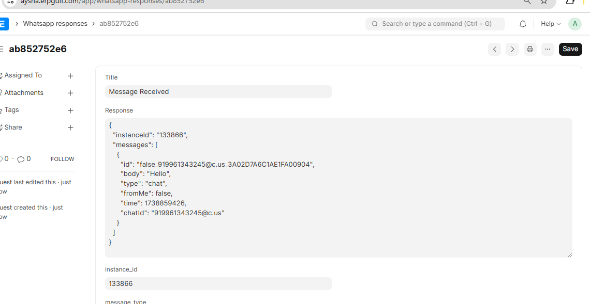

# 📌 Whatsapp Saudi

Integration with **Saudi.support WhatsApp** for **ERPNext**.

#### License

mit# whatsapp_saudi<br>
This app integrates ERPNext with  4Whats.net ,  Global   Whatsapp provider. The provider site can be accessed here (https://4whats.net/)


We have added following features in Version-2.0.

1- Added print PDF and document sending from notification to WhatsAPP.<br>
2- Moved all time taking processes to background job, so users will not feels slowness or delay.<br>
3- Added features for error and success logs. Errors are available now on error log and success messages are available on ultramsg_4_ERPNext log.<br>
If you find any issue using this app, please raise it on Github issue page or send email to support@erpgulf.com.


## 🔧 Installation Guide
Follow these steps to install **Whatsapp Saudi** and integrate it with **ERPNext**:

### 1️⃣ Prerequisites
- You must have **ERPNext** installed and running.
- Install **Python** (>=3.8) and **Frappe Framework**.

### 2️⃣ Clone the Repository
Open your terminal and run:
```bash
git clone https://github.com/ERPGulf/whatsapp_saudi.git
cd whatsapp_saudi
```

### 3️⃣ Install Dependencies
Run the following command inside the project directory:
```bash
pip install -r requirements.txt
```

### 4️⃣ Setup ERPNext App
Inside your ERPNext environment, install the app:
```bash
bench get-app whatsapp_saudi
bench --site your-site-name install-app whatsapp_saudi
```

### 5️⃣ Migrate and Restart
```bash
bench --site your-site-name migrate
bench restart
```
## ⚙️ Configuration

### 1️⃣ Set Up WhatsApp API
- This app integrates with **4Whats.net**, a **Global WhatsApp provider**.
- Visit (https://4whats.net/) to create an API key.
- Add your API Key and Instance ID in ERPNext settings.
### 2️⃣ ERPNext Configuration
- Navigate to ERPNext > WhatsApp Saudi.
- Enter your 4Whats.net credentials token and instance id and the number to whom u want to send.


- After the entry of data click on the button(send test message) then message will send to whatsapp number.
<br>


### 3️⃣ Webhook Setup for Incoming Messages
- In **4Whats.net**, set up a webhook to receive incoming messages.
- Use the following Base URL for the webhook:
```bash
https://your-erpnext-instance.com/api/method/whatsapp_saudi.receive_whatsapp_message
```
(Replace your-erpnext-instance.com with your actual ERPNext URL.)

- This webhook ensures that all incoming messages are stored in the WhatsApp Response Doctype in ERPNext.
<br>



## 🚀 Features (Version 2.0)
### ✅ New Additions:
1-**Send PDFs & Documents**
- You can now send PDF documents directly via WhatsApp.

2-**Error logs**
- Errors are now logged under error logs.

3-**incoming Messages**
- We have set up a webhook in 4Whats.net to handle incoming messages.
- Incoming messages are automatically stored in the WhatsApp Response Doctype in ERPNext for tracking and further processing.

# 👤 Author
Aysha Sithara.
Maintained by ERPGulf Team.